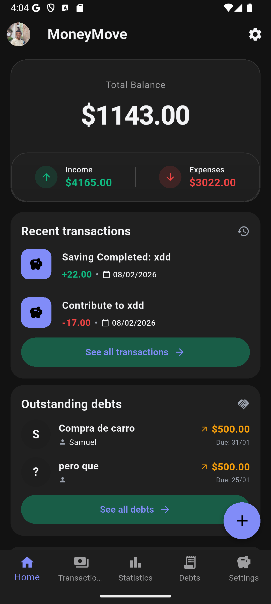
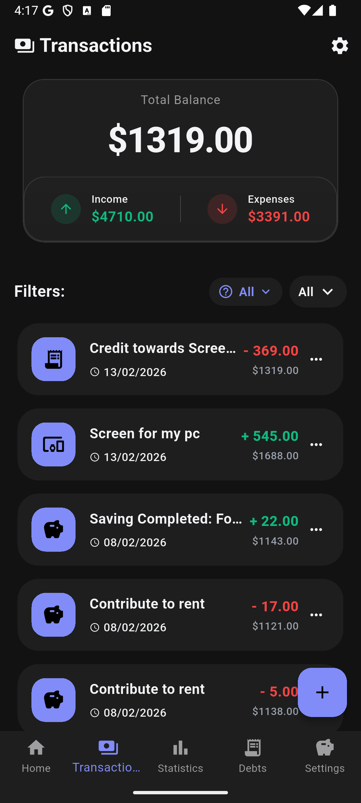

# MoneyMove

MoneyMove is a cross-platform mobile application built with Flutter that helps users manage and track their personal and shared finances with real-time synchronization and collaborative features.


---

## 🚀 Features

- Track income, expenses, debts, and savings
- Debt and savings progress tracking with partial payments (real-time progress updates)
- Automatic balance calculation based on transactions
- Transaction categorization for better financial organization
- Advanced filters (monthly, yearly, custom periods)
- Financial statistics and visual charts for spending analysis
- Google authentication with secure cloud storage (Firestore)
- Online/offline support with automatic data synchronization
- Shared Mode (Space Mode) to manage finances collaboratively with other users
- Dark and light mode support
- Multi-language support (English & Spanish)

---

## 🛠 Tech Stack

- Flutter
- Dart
- State Management: Provider
- Firebase (Firestore)
- SharedPreferences

---

## 📱 Screenshots





---

## 🧠 Architecture & Technical Decisions

- The project follows a well-structured modular architecture inside the `lib` folder, separating concerns into config, models, providers, screens, services, utils, and reusable widgets.
- Business logic and state management are primarily handled using Provider, minimizing unnecessary rebuilds and keeping the UI clean. In specific local scenarios, setState is used for simpler state updates.
- Data persistence is implemented using Firebase Firestore as the main database. Data is fetched and synchronized through Providers, allowing centralized state handling across the app.
- SharedPreferences is used for local configurations such as dark mode, selected language, and tutorial completion status.
- Strict validation is enforced for critical fields like title and amount to ensure data integrity. Optional fields such as description or debt participants allow flexible input.
- Special attention was given to designing and implementing both personal mode and shared mode, ensuring they can function simultaneously without conflicts. This required careful state and logic management.
- Reusable widgets were created for statistics and charts to maintain consistency and improve maintainability.


---

## 📌 What I Learned

- Building a complete mobile application from scratch using Flutter and Dart, understanding how UI and business logic interact within a reactive framework.
- Managing global and local state efficiently using Provider, applying structured state management beyond basic approaches.
- Working with asynchronous programming in Dart, especially when handling Firestore operations and real-time data updates.
- Integrating Firebase services, including Firestore and authentication, and understanding how backend services connect to mobile applications.
- Implementing multi-language support (localization) and managing user preferences such as theme and onboarding state.
- Designing scalable project structures by separating models, services, providers, and reusable widgets.
- Using AI tools as a development assistant to accelerate learning, debug efficiently, and improve code quality without compromising understanding.


---

## ▶️ Demo

YouTube demo link:  
[Paste your YouTube link here]

---

## 📦 Installation

If you want to run the project locally:

```bash
git clone https://github.com/Visac95/money_move.git
cd moneymove
flutter pub get
flutter run
